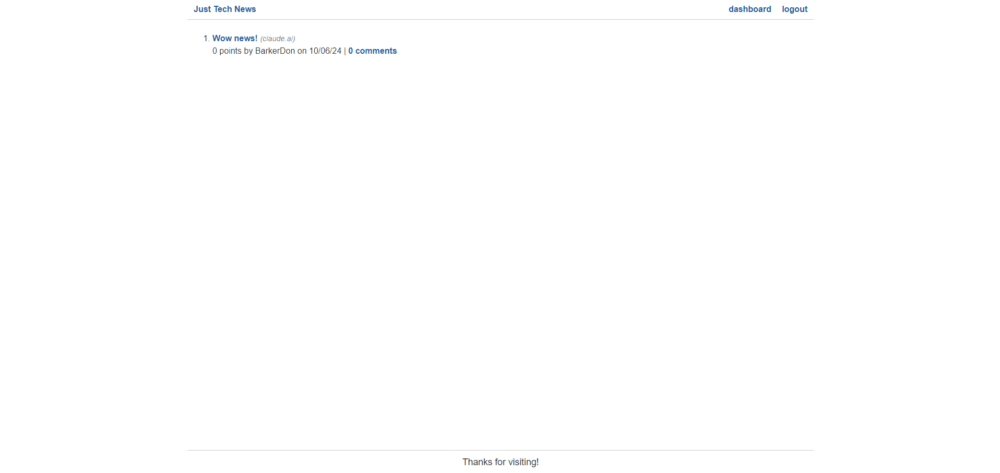

# Python Newsfeed

- Python Newsfeed is a dynamic web application designed to create and manage your personalized tech news feed. Built with Flask and Python, this project showcases modern web development techniques and best practices in building full-stack applications.

## Description

- <strong>Motivation:</strong> Our goal was to create an interactive platform where tech enthusiasts can share, discuss, and stay updated on the latest industry news and developments.
- <strong>Purpose:</strong> This project demonstrates proficiency in Python web development, database management with MySQL, and deployment strategies using Gunicorn and Heroku.
- <strong>Problem Solved:</strong> Python Newsfeed addresses the need for a customizable, user-driven tech news aggregator, allowing users to post, comment on, and upvote news items.
- <strong>Learning Outcomes:</strong> Through this project, developers can gain hands-on experience with Flask application structure, database integration, user authentication, and deploying Python web applications to cloud platforms.

## Table of Contents (Optional)

Here is a table of contents to make it easy for users to locate which section they need.

- [Installation](#installation)
- [Usage](#usage)
- [Credits](#credits)
- [License](#license)

## Installation

1. Install Required Software:

- Python 3.7 or higher.
- pip (Python package installer).
- MySQL.

2. Clone Your Repository:

- `git clone https://github.com/your-username/python-newsfeed.git`
- `cd python-newsfeed`

3. Set Up a Virtual Environment:

- `python -m venv venv`.
- `source venv/bin/activate` # On Windows use ``venv\Scripts\activate``.

4. Install Dependencies:

- `pip install -r requirements.txt`

5. Set Up the Database:

- Create a MySQL database for the project.
- Update the database configuration in `config.py`.

6. Initialize the Database:

- `flask db upgrade`

7. Run the Application:

- `flask run`

## Usage

Python Newsfeed allows users to:

- `Create an account and log in`
- `Post new tech news items`
- `Comment on existing news items`
- `Upvote interesting news`
- `Customize their news feed`

- <strong>Python Newsfeed Link</strong>

- [Website](https://python-newsfeed-git-182edacb47b2.herokuapp.com/)

- <strong>Python Newsfeed Screenshots</strong>

- 

## Support

N/A

## Credits

People who worked on this project were Brennan Waterbury. You can contact the contributors through the GitHub profile(s) links listed here.

- <a href="https://github.com/bwater47" alt="GitHub Link">GitHub Profile - Brennan Waterbury</a>

## License

N/A

## Features

<strong>Python Newsfeed:</strong> Python Newsfeed was created to provide an interactive platform where users can login and post a title and a link to posts they've found interesting to create a newsfeed of their own.

## Contributing

Contributing is allowed if you get in contact with any of the contributors. Contact us by heading to our LinkedIns to send us a message.

- [Contributor Covenant](https://www.contributor-covenant.org/)

## Authors and Acknowledgment

Bootcamp Spot. (10/06/24). https://bootcampspot.com/

W3Schools Online Web Tutorials. (10/06/24). https://www.w3schools.com/

Chatgpt. ChatGPT. (10/06/24). https://openai.com/chatgpt

• Please note: While ChatGPT was utilized to generate dialog content for the README file, it was not involved in the generation of any code, HTML edits, CSS edits, or other assets within the repository apart from this README specifically.

• All other sources, links, and information utilized within the project were obtained from the provided sources mentioned in this paragraph. This includes class materials, modules, TA guidance, instructor-provided resources, as well as communication through platforms such as Slack or Discord. Additionally, numerous links and resources were provided within the assignment instructions and demonstrated during class sessions.

## Roadmap

Tests: N/A

## Project status

In-Progress